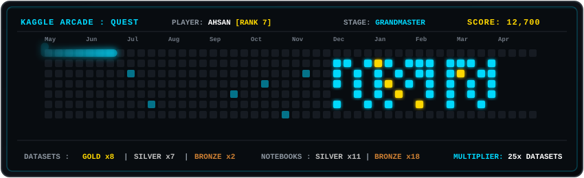

<div align="center">


<br/>


[](https://www.kaggle.com/ahsanneural)
[](https://www.linkedin.com/in/muhammad-ahsan-7b10073b5/)
[](mailto:ahsanatwork24@gmail.com)

</div>

---

## About Me

```txt
╔══════════════════════════════════════════════════════════════╗
║  Degree   :  BS Artificial Intelligence                      ║
║  Location :  Punjab, Pakistan                                ║
║  Focus    :  Computer Vision · Machine Learning · DL         ║
║  Kaggle   :  Datasets Grandmaster (#7) · Notebooks Master    ║
║  Motto    :  Teaching machines to see & understand           ║
║  Status   :  [█████████░] Innovating & Building Models...    ║
╚══════════════════════════════════════════════════════════════╝
```

---

## Currently Working On

<table>
<tr>
<td><b>Kaggle Datasets & Notebooks</b></td>
<td>Publishing ML-ready datasets across Computer Vision, Machine Learning, and Deep Learning domains</td>
</tr>
<tr>
<td><b>Deep Learning Research</b></td>
<td>Comparative neural architectures (Transformers, GRUs, LSTMs), medical imaging classification, and Explainable AI (SHAP)</td>
</tr>
<tr>
<td><b>Currently Learning</b></td>
<td>Scalable ML model deployment, MLOps, and advanced computer vision</td>
</tr>
</table>

---

## Tech Stack

<div align="center">

### Languages


### AI, Machine Learning & Computer Vision


-0D1117?style=for-the-badge&logo=yolo&logoColor=00FFFF)

<br/>


### Web & Deployment


### Tools & Platforms


</div>

---

## Kaggle Achievements

<div align="center">

<table>
<tr>
<td align="center" width="50%" style="padding: 16px;">

### Datasets Grandmaster
<kbd><b>World Rank #7</b> of 11,796</kbd> &nbsp;•&nbsp; <kbd>Highest Ever: <b>#6</b></kbd>

<br/><br/>


<br/>

> **Global Reach:** **25 published datasets** with **~12.7k combined downloads**

</td>
<td align="center" width="50%" style="padding: 16px;">

### Notebooks Master
<kbd><b>World Rank #176</b> of 60,412</kbd> &nbsp;•&nbsp; <kbd>Highest Ever: <b>#125</b></kbd>

<br/><br/>


<br/>

> **Notebook Craft:** Deep learning architectures, benchmark pipelines & EDA

</td>
</tr>
</table>

[](https://www.kaggle.com/ahsanneural)

</div>

---

## Kaggle Activity & Arcade Quest

<div align="center">



<br/>

> **Snake Arcade Simulation:** Slithering through the Kaggle contribution grid, harvesting Gold medals and dataset downloads.  
> Peak activity recorded during **December 2025 — March 2026**.

</div>

---

## Featured Projects

<table>
<tr>
<td><b>Stock Forecasting with Deep Learning</b><br/><sub>Deep Learning · Time Series Forecasting</sub></td>
<td>Multi-model comparative benchmarking across ANN, LSTM, GRU, and Transformer architectures with hyperparameter tuning and an interactive dashboard. Best GRU config: window 60, batch 64, dropout 0.1, Adam, with R² of 0.91.</td>
</tr>
<tr>
<td><b>Employee Attrition Prediction (IBM HR)</b><br/><sub>Machine Learning · Explainable AI</sub></td>
<td>Predictive modeling on IBM HR data comparing Logistic Regression, Decision Tree, Random Forest, and XGBoost with SMOTE, Stratified CV, GridSearchCV, and SHAP. Fixed leakage issue; XGBoost reached F1 of ~0.85.</td>
</tr>
<tr>
<td><b>Pakistan Air Quality & Weather — 10 Cities</b><br/><sub>Data Science · Environmental</sub></td>
<td>Hourly PM2.5, PM10, CO, NO2, O3 & weather data across major Pakistani cities</td>
</tr>
<tr>
<td><b>NASA Astronomy Picture of the Day (1995–2026)</b><br/><sub>NLP · Computer Vision</sub></td>
<td>30+ years of APOD entries — 11,186 records for multimodal NLP & astronomical vision research</td>
</tr>
<tr>
<td><b>Rare Neurological Diseases MRI — Curated Edition</b><br/><sub>Computer Vision · Medical AI</sub></td>
<td>2,000 curated MRI scans across 5 rare diseases, train/val/test splits included</td>
</tr>
<tr>
<td><b>Global Food & Nutrition Database 2026</b><br/><sub>Machine Learning · Health</sub></td>
<td>45,000+ foods with Nutri-Score, allergens, health scores & full nutrition facts</td>
</tr>
<tr>
<td><b>Tech Layoffs & Hiring Trends 2025–2026</b><br/><sub>Data Analysis · NLP</sub></td>
<td>153K+ layoffs with AI impact analysis, 2K new tech roles & salary data</td>
</tr>
<tr>
<td><b>AI-Generated vs Human-Written Code</b><br/><sub>NLP · Classification</sub></td>
<td>Python code classification dataset comparing AI-style vs human-style coding</td>
</tr>
<tr>
<td><b>Customer Segmentation with K-Means</b><br/><sub>Machine Learning · Clustering</sub></td>
<td>End-to-end notebook on clustering customers using K-Means with full EDA</td>
</tr>
</table>

---

## Connect

<div align="center">

[](https://www.linkedin.com/in/muhammad-ahsan-7b10073b5/)
[](https://www.kaggle.com/ahsanneural)
[](mailto:ahsanatwork24@gmail.com)

</div>

---

<div align="center">


</div>


